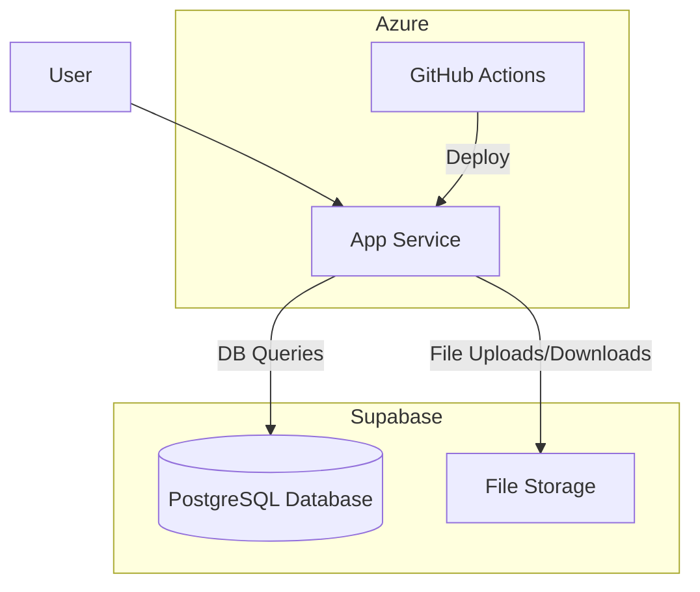

# KeyLMSNytro: Azure & Supabase Deployment Guide

**Version:** 1.0
**Date:** January 29, 2026

This document provides a comprehensive guide for deploying the KeyLMSNytro application to **Microsoft Azure**, using **Supabase** for the database and file storage. This approach replaces the previous recommendations for Laravel Cloud and AWS S3, aligning with your existing infrastructure preferences.

## 1. Architecture Overview

This architecture leverages the strengths of both platforms:

*   **Azure App Service**: Provides a robust, scalable, and fully managed platform for hosting the containerized Laravel application.
*   **Supabase**: Offers a simple and powerful backend-as-a-service, which we will use for its managed PostgreSQL database and S3-compatible object storage.



## 2. Supabase Project Setup

For a multi-environment setup, you should create **two separate Supabase projects**: one for `staging` and one for `production` to ensure complete data isolation.

1.  **Create Supabase Project**: Go to the [Supabase Dashboard](https://app.supabase.io/) and create a new project.
2.  **Get Database Credentials**:
    *   Navigate to **Project Settings** -> **Database**.
    *   Under **Connection string**, find your database credentials (Host, Port, User, Password, Database name).
3.  **Get Storage Credentials**:
    *   Navigate to **Storage** and create a new bucket (e.g., `keylms-assets`). Make it a **public bucket** if you need to serve files directly.
    *   Navigate to **Project Settings** -> **API**.
    *   Find your **Project URL** and the `service_role` **API Key**. These will be used to configure the file storage driver.

## 3. KeyLMSNytro Application Configuration

To connect Laravel to Supabase, you need to update the configuration for both the database and the filesystem.

### 3.1. Database Configuration

Update your `.env` file with the Supabase database credentials.

```dotenv
DB_CONNECTION=pgsql
DB_HOST=your-supabase-host
DB_PORT=5432
DB_DATABASE=postgres
DB_USERNAME=postgres
DB_PASSWORD=your-supabase-db-password
```

### 3.2. Storage Configuration

1.  **Install Supabase Flysystem Driver**: Install the community-maintained Flysystem driver for Supabase.

    ```bash
    composer require mahmoud-z/flysystem-supabase-v3
    ```

2.  **Configure Filesystem Disk**: In `config/filesystems.php`, add a new disk for Supabase.

    ```php
    // config/filesystems.php

    'disks' => [
        // ... other disks

        'supabase' => [
            'driver' => 'supabase',
            'url' => env('SUPABASE_URL'),
            'key' => env('SUPABASE_KEY'),
            'bucket' => env('SUPABASE_BUCKET'),
        ],
    ],
    ```

3.  **Update `.env` File**: Add the Supabase storage credentials to your `.env` file and set it as the default filesystem.

    ```dotenv
    FILESYSTEM_DRIVER=supabase

    SUPABASE_URL=your-supabase-project-url
    SUPABASE_KEY=your-supabase-service-role-key
    SUPABASE_BUCKET=your-supabase-bucket-name
    ```

## 4. Azure App Service & Deployment

### 4.1. Create Azure App Service

1.  In the Azure Portal, create a new **App Service**.
2.  **Publish**: Select `Docker Container`.
3.  **Operating System**: Select `Linux`.
4.  Create an **App Service Plan** based on your performance and cost requirements.
5.  In the **Docker** tab, you can configure it to pull from your GitHub repository (this will be handled by our GitHub Actions workflow later).

### 4.2. Deployment with GitHub Actions

Create a GitHub Actions workflow to automate deployments. This workflow will build the application and deploy it to the correct Azure App Service environment based on the branch.

**File**: `.github/workflows/deploy.yml`

```yaml
name: Deploy to Azure

on:
  push:
    branches:
      - main
      - develop

jobs:
  build-and-deploy:
    runs-on: ubuntu-latest
    steps:
      - name: Checkout code
        uses: actions/checkout@v3

      - name: Set up PHP
        uses: shivammathur/setup-php@v2
        with:
          php-version: '8.3'

      - name: Install Composer dependencies
        working-directory: ./source
        run: composer install --no-interaction --prefer-dist --optimize-autoloader

      - name: Install NPM dependencies
        working-directory: ./source
        run: npm install

      - name: Build assets
        working-directory: ./source
        run: npm run build

      - name: Login to Azure
        uses: azure/login@v1
        with:
          creds: ${{ secrets.AZURE_CREDENTIALS }}

      - name: Deploy to Staging
        if: github.ref == 'refs/heads/develop'
        uses: azure/webapps-deploy@v2
        with:
          app-name: 'keylms-staging' # Your staging App Service name
          package: './source'

      - name: Deploy to Production
        if: github.ref == 'refs/heads/main'
        uses: azure/webapps-deploy@v2
        with:
          app-name: 'keylms-production' # Your production App Service name
          package: './source'
```

### 4.3. GitHub Secrets

In your GitHub repository, go to **Settings** -> **Secrets and variables** -> **Actions** and add the following secrets:

*   `AZURE_CREDENTIALS`: The JSON output from creating a service principal in Azure (`az ad sp create-for-rbac`).
*   `SUPABASE_DB_PASSWORD_STAGING`
*   `SUPABASE_URL_STAGING`
*   `SUPABASE_KEY_STAGING`
*   `SUPABASE_DB_PASSWORD_PRODUCTION`
*   `SUPABASE_URL_PRODUCTION`
*   `SUPABASE_KEY_PRODUCTION`

### 4.4. Azure App Service Configuration

In each App Service environment (staging and production), go to **Configuration** -> **Application settings** and add the environment variables from your `.env` file. Use the GitHub secrets to populate the Supabase credentials for each environment.

## 5. Startup & Post-Deployment

1.  **Database Migrations**: Add the migration command to your GitHub Actions workflow or run it manually from the App Service SSH terminal on the first deployment.

    ```yaml
    # Add to deploy steps in deploy.yml
    - name: Run database migrations
      run: php source/artisan migrate --force
    ```

2.  **Scheduler**: In your App Service, go to **WebJobs** and create a new **triggered** WebJob that runs `php /home/site/wwwroot/source/artisan schedule:run` on a schedule (e.g., every minute).

3.  **Queue Worker**: Create a **continuous** WebJob that runs `php /home/site/wwwroot/source/artisan queue:work redis --timeout=0` to process background jobs.

This setup provides a robust, scalable, and automated deployment pipeline for KeyLMSNytro on Azure with Supabase integration, giving you full control over your infrastructure.
