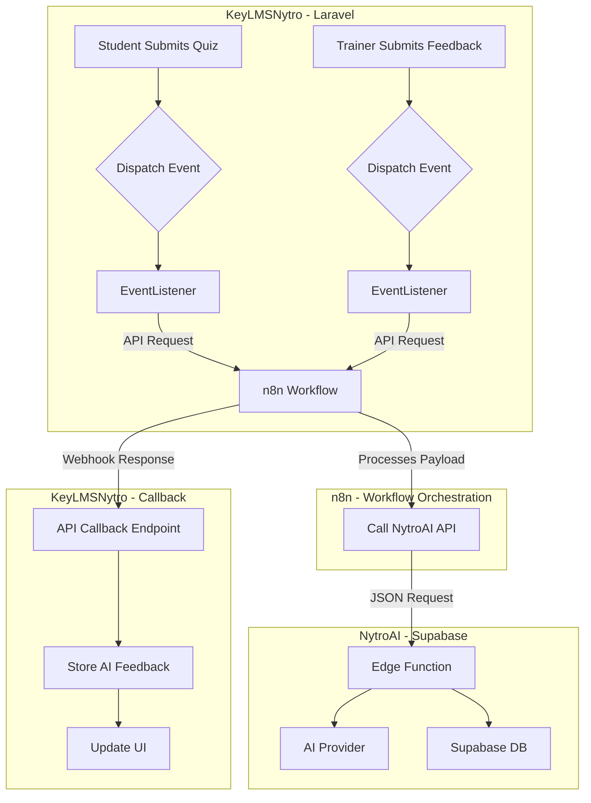
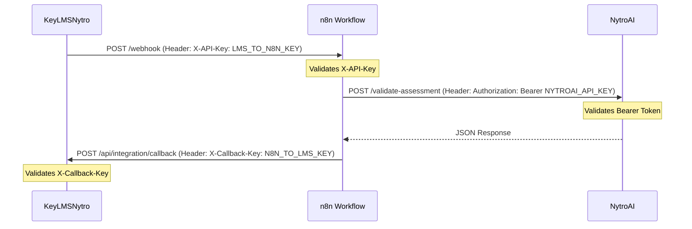

# KeyLMSNytro & NytroAI Integration: Technical Implementation Plan

**Version:** 1.0
**Date:** January 29, 2026

## 1. Introduction

This document outlines the technical steps required to integrate the **KeyLMSNytro** Learning Management System with the **NytroAI** validation platform. The integration will leverage NytroAI to enhance the assessment and feedback process within KeyLMSNytro.

The integration will focus on three primary objectives:

1.  **AI-Powered Pre-Marking of Student Assessments**: Automatically evaluate student quiz submissions to provide an initial assessment for trainers.
2.  **AI Review of Trainer Evaluations**: Analyze the quality and constructiveness of feedback provided by trainers to students.
3.  **Twilio Integration for Notifications**: Send SMS notifications for key events, with NytroAI managing the underlying Twilio API calls.

All API interactions will be orchestrated through **n8n workflows** to centralize and manage external service calls, as per the established architectural preference.

## 2. High-Level Integration Architecture

The integration will follow a decoupled, event-driven architecture. KeyLMSNytro will dispatch Laravel events for specific actions (e.g., quiz submission). These events will be handled by listeners that make API calls to dedicated n8n workflows. The n8n workflows will, in turn, interact with the NytroAI API (Supabase Edge Functions) to perform the required AI tasks.



## 3. Implementation Steps

### 3.1. AI Pre-Marking of Student Assessments

This feature will provide trainers with an AI-generated first pass of a student's quiz submission.

#### Step 1: Create a New Event and Listener

In KeyLMSNytro, create a new event to be dispatched when a student submits a quiz.

1.  **Create Event**: `app/Events/StudentAssessmentSubmitted.php`

    ```php
    namespace App\Events;

    use App\Models\QuizAttempt;
    use Illuminate\Foundation\Events\Dispatchable;
    use Illuminate\Queue\SerializesModels;

    class StudentAssessmentSubmitted
    {
        use Dispatchable, SerializesModels;

        public $quizAttempt;

        public function __construct(QuizAttempt $quizAttempt)
        {
            $this->quizAttempt = $quizAttempt;
        }
    }
    ```

2.  **Create Listener**: `app/Listeners/TriggerAIAssessment.php`

    This listener will be responsible for preparing the data and calling the n8n workflow.

3.  **Register Event/Listener**: In `app/Providers/EventServiceProvider.php`, register the new event and listener.

#### Step 2: Trigger the Event

In `AssessmentsController.php`, after a student successfully submits an assessment, dispatch the event.

#### Step 3: Prepare Data and Call n8n Workflow

In the `TriggerAIAssessment` listener:

1.  **Gather Data**: Collect the student's answers (`$quizAttempt->submitted_answers`) and the corresponding questions (`$quizAttempt->quiz->questions`).
2.  **Format Payload**: Create a JSON payload containing the questions and answers.
3.  **API Call**: Make a POST request to a new n8n webhook URL, sending the JSON payload.

#### Step 4: Create a New Database Table for AI Feedback

Create a new migration in KeyLMSNytro to store the AI's evaluation. This keeps it separate from the human trainer's evaluation.

```bash
php artisan make:migration create_ai_evaluations_table
```

**Schema for `ai_evaluations`:**

| Column | Type | Description |
|---|---|---|
| `id` | `bigIncrements` | Primary Key |
| `quiz_attempt_id` | `unsignedBigInteger` | Foreign key to `quiz_attempts` |
| `status` | `string` | Overall status from AI (e.g., `MET`, `PARTIALLY_MET`) |
| `results` | `json` | Per-question AI feedback and scores |
| `raw_response` | `json` | The full, raw JSON response from NytroAI |
| `created_at` / `updated_at` | `timestamps` | Timestamps |

#### Step 5: Update the UI

Modify the assessment review view (`resources/views/content/assessments/review.blade.php`) to display the AI-generated feedback alongside the student's answers. This feedback should be clearly labeled as originating from the AI.

### 3.2. AI Review of Trainer Evaluations

This feature will analyze the quality of feedback provided by trainers.

#### Step 1: Create a New Event and Listener

1.  **Create Event**: `app/Events/TrainerFeedbackProvided.php`
2.  **Create Listener**: `app/Listeners/TriggerAITrainerReview.php`
3.  **Register Event/Listener**.

#### Step 2: Trigger the Event

In `AssessmentsController.php`, within the `feedbackPost` method (after the trainer's evaluation is saved), dispatch the `TrainerFeedbackProvided` event.

#### Step 3: Prepare Data and Call n8n Workflow

In the `TriggerAITrainerReview` listener:

1.  **Gather Data**: Collect the student's answer, the question, and the trainer's feedback (`$evaluation->results`).
2.  **Format Payload**: Create a JSON payload.
3.  **API Call**: Make a POST request to a new n8n webhook for trainer feedback analysis.

#### Step 4: Create a New Database Table for Trainer Review

Create a migration for an `ai_trainer_reviews` table.

**Schema for `ai_trainer_reviews`:**

| Column | Type | Description |
|---|---|---|
| `id` | `bigIncrements` | Primary Key |
| `evaluation_id` | `unsignedBigInteger` | Foreign key to `evaluations` |
| `score` | `decimal` | A score from 0-100 on the quality of the feedback |
| `strengths` | `text` | What was good about the feedback |
| `areas_for_improvement` | `text` | Suggestions for improving the feedback |
| `raw_response` | `json` | The full, raw JSON response from NytroAI |
| `created_at` / `updated_at` | `timestamps` | Timestamps |

#### Step 5: Display the Review (Optional)

A new interface could be built for administrators or managers to view the AI-powered reviews of trainer feedback, providing insights into training quality.

### 3.3. Twilio Integration for Notifications

NytroAI will handle the direct integration with Twilio. KeyLMSNytro will only need to call an n8n workflow.

#### Step 1: Identify Notification Points

Identify the key events in KeyLMSNytro where an SMS notification would be valuable. Examples:

*   Assessment marked as `SATISFACTORY`.
*   Assessment `RETURNED` to the student.
*   Certificate issued.

#### Step 2: Create a Reusable Notification Job

Create a queued job in Laravel to handle sending SMS notifications.

```bash
php artisan make:job SendSmsNotification
```

This job will take the recipient's phone number and the message as arguments. It will be responsible for making the API call to the n8n workflow.

#### Step 3: Dispatch the Job

At the identified notification points in the code, dispatch the `SendSmsNotification` job.

```php
SendSmsNotification::dispatch($user->phone_number, 'Your assessment has been marked as Satisfactory.');
```

This approach ensures that API calls to the notification service do not block the main application thread.

## 4. API Key Management

Secure management of API keys is critical for the integration between KeyLMSNytro, n8n, and NytroAI. This section outlines the recommended approach for handling API keys across all integration points.

### 4.1. Architecture Overview

API keys will be managed at **three levels**:

1.  **KeyLMSNytro to n8n**: A shared secret to authenticate requests from KeyLMSNytro to the n8n webhook.
2.  **n8n to NytroAI**: API keys for NytroAI's Supabase Edge Functions, stored securely in n8n.
3.  **n8n to KeyLMSNytro (Callback)**: A shared secret to authenticate webhook callbacks from n8n back to KeyLMSNytro.



### 4.2. KeyLMSNytro Configuration

Store all API keys and webhook URLs in the `.env` file. **Never commit API keys to version control.**

**`.env` File:**

```dotenv
# n8n Integration
N8N_WEBHOOK_BASE_URL=https://your-n8n-instance.com/webhook
N8N_PREMARK_WEBHOOK_PATH=/premark-assessment
N8N_TRAINER_REVIEW_WEBHOOK_PATH=/trainer-review
N8N_SMS_WEBHOOK_PATH=/send-sms

# API Key for KeyLMSNytro -> n8n requests
N8N_API_KEY=your-secure-random-key-here

# API Key for n8n -> KeyLMSNytro callbacks
INTEGRATION_CALLBACK_KEY=another-secure-random-key-here
```

**`config/services.php`:**

```php
return [
    // ... other services

    'nytroai' => [
        'n8n_base_url' => env('N8N_WEBHOOK_BASE_URL'),
        'premark_path' => env('N8N_PREMARK_WEBHOOK_PATH'),
        'trainer_review_path' => env('N8N_TRAINER_REVIEW_WEBHOOK_PATH'),
        'sms_path' => env('N8N_SMS_WEBHOOK_PATH'),
        'api_key' => env('N8N_API_KEY'),
        'callback_key' => env('INTEGRATION_CALLBACK_KEY'),
    ],
];
```

### 4.3. Sending Authenticated Requests to n8n

Create a dedicated service class to handle all API calls to n8n, ensuring the API key is always included.

**`app/Services/NytroAIIntegrationService.php`:**

```php
namespace App\Services;

use Illuminate\Support\Facades\Http;
use Illuminate\Support\Facades\Log;

class NytroAIIntegrationService
{
    protected string $baseUrl;
    protected string $apiKey;

    public function __construct()
    {
        $this->baseUrl = config('services.nytroai.n8n_base_url');
        $this->apiKey = config('services.nytroai.api_key');
    }

    public function requestPreMark(array $payload): void
    {
        $this->sendRequest(
            config('services.nytroai.premark_path'),
            $payload
        );
    }

    public function requestTrainerReview(array $payload): void
    {
        $this->sendRequest(
            config('services.nytroai.trainer_review_path'),
            $payload
        );
    }

    protected function sendRequest(string $path, array $payload): void
    {
        try {
            Http::withHeaders([
                'X-API-Key' => $this->apiKey,
                'Content-Type' => 'application/json',
            ])->post($this->baseUrl . $path, $payload);
        } catch (\Exception $e) {
            Log::error('NytroAI Integration Error', [
                'path' => $path,
                'error' => $e->getMessage(),
            ]);
        }
    }
}
```

### 4.4. Securing the Callback Endpoint

Create a middleware to validate incoming webhook callbacks from n8n.

**`app/Http/Middleware/ValidateIntegrationCallback.php`:**

```php
namespace App\Http\Middleware;

use Closure;
use Illuminate\Http\Request;
use Symfony\Component\HttpFoundation\Response;

class ValidateIntegrationCallback
{
    public function handle(Request $request, Closure $next): Response
    {
        $expectedKey = config('services.nytroai.callback_key');
        $providedKey = $request->header('X-Callback-Key');

        if (!$providedKey || !hash_equals($expectedKey, $providedKey)) {
            return response()->json(['error' => 'Unauthorized'], 401);
        }

        return $next($request);
    }
}
```

**Register the Middleware** in `app/Http/Kernel.php`:

```php
protected $middlewareAliases = [
    // ... other middleware
    'integration.callback' => \App\Http\Middleware\ValidateIntegrationCallback::class,
];
```

**Apply to the Callback Route** in `routes/api.php`:

```php
Route::post('/integration/callback', [IntegrationCallbackController::class, 'handle'])
    ->middleware('integration.callback');
```

### 4.5. n8n Workflow Configuration

Within n8n, API keys should be stored as **credentials**, not hardcoded in workflows.

1.  **Create Credentials**: In n8n, go to **Credentials** and create new entries for:
    *   `KeyLMSNytro API Key` (the `N8N_API_KEY` value)
    *   `NytroAI API Key` (the Supabase Edge Function key)
    *   `KeyLMSNytro Callback Key` (the `INTEGRATION_CALLBACK_KEY` value)

2.  **Validate Incoming Requests**: In the n8n webhook trigger node, add a code node to validate the `X-API-Key` header against the stored credential.

3.  **Use Credentials in HTTP Nodes**: When calling NytroAI or the KeyLMSNytro callback, use the stored credentials to populate the `Authorization` or `X-Callback-Key` headers.

### 4.6. Azure Key Vault Integration (Recommended for Production)

For production deployments on Azure, it is recommended to store all API keys in **Azure Key Vault** rather than in `.env` files or n8n credentials directly.

**Benefits:**

*   Centralized secret management.
*   Automatic key rotation.
*   Audit logging of secret access.
*   Integration with Azure App Service via Managed Identity.

**Implementation:**

1.  Store `N8N_API_KEY`, `INTEGRATION_CALLBACK_KEY`, and `NYTROAI_API_KEY` in Azure Key Vault.
2.  Configure Azure App Service to access Key Vault using a Managed Identity.
3.  Reference secrets in App Service configuration using Key Vault references (e.g., `@Microsoft.KeyVault(SecretUri=https://your-vault.vault.azure.net/secrets/N8N-API-KEY)`).
4.  For n8n, if self-hosted on Azure, configure it to pull secrets from Key Vault at startup.

## 5. NytroAI & n8n Workflow Configuration

### For KeyLMSNytro:

*   Store n8n webhook URLs and API keys in the `.env` file (or Azure Key Vault for production).
*   Use the `NytroAIIntegrationService` class for all API calls to n8n.
*   Protect the callback endpoint with the `ValidateIntegrationCallback` middleware.

### For n8n:

*   Create a new workflow for each integration point (pre-marking, trainer review, SMS).
*   Store all API keys as n8n credentials.
*   Validate incoming requests using the `X-API-Key` header.
*   The workflow will receive the payload from KeyLMSNytro.
*   It will then call the appropriate NytroAI Supabase Edge Function (`/validate-assessment` or a new function for trainer reviews).
*   For pre-marking, the workflow must first create a temporary document (e.g., Markdown) from the student's answers and upload it to a location accessible by NytroAI (or use the Gemini File API).
*   After receiving the response from NytroAI, the workflow will call the webhook callback URL in KeyLMSNytro to send the results back, including the `X-Callback-Key` header.

## 5. Conclusion

This integration plan provides a clear path to leveraging the AI capabilities of NytroAI within KeyLMSNytro. By following an event-driven, decoupled architecture and centralizing API calls in n8n, the integration will be scalable, maintainable, and robust.
