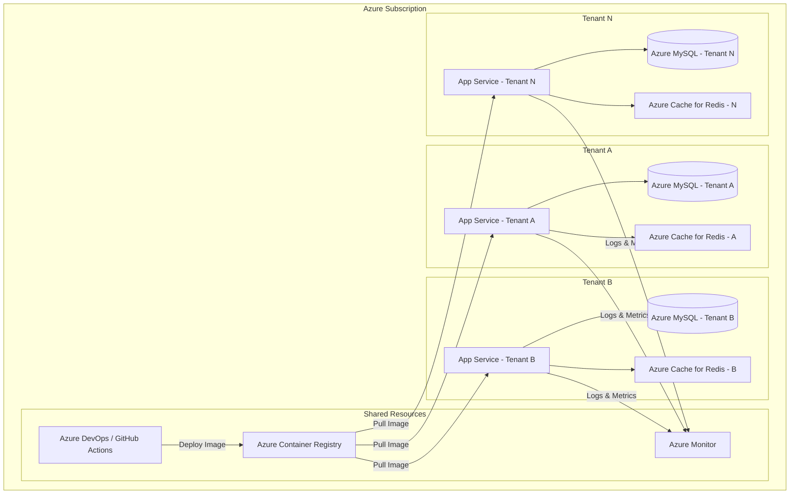

# KeyLMSNytro: Multi-Tenancy vs. PaaS/IaaS Analysis

**Version:** 1.0
**Date:** January 29, 2026

## 1. Current Architecture & The Multi-Tenancy Challenge

KeyLMSNytro is currently implemented as a **single-tenant application with a shared schema**. While there is a `companies` table and users are associated with a company, core resources like courses, lessons, and quizzes are global and shared across all companies. This architecture is simple and effective for a single organization but does not provide the data isolation required to serve multiple, distinct tenants (e.g., different businesses).

The challenge is to evolve the architecture to support multiple tenants securely and scalably. There are two primary strategic paths to achieve this:

1.  **Convert to a True Multi-Tenant Application**: Rearchitect the application to support multiple tenants within a single codebase and database.
2.  **Leverage PaaS/IaaS for Tenant Isolation**: Keep the application as a single-tenant system and deploy a separate, isolated instance for each new tenant.

This document provides a technical comparison of these two approaches.

## 2. Option 1: Convert to a True Multi-Tenant Application

This approach involves modifying the existing Laravel application to make it tenant-aware. All data would be stored in a single database, with a `company_id` (acting as a `tenant_id`) added to every relevant table to partition the data.

### Implementation Strategy

1.  **Use a Multi-Tenancy Package**: Integrate a package like `spatie/laravel-multitenancy` to handle the complexities of tenant identification and data scoping.
2.  **Database Schema Changes**: Add a `company_id` foreign key to all tenant-specific tables, including `courses`, `lessons`, `quizzes`, `questions`, `evaluations`, etc.
3.  **Implement Global Scopes**: Use Laravel's global scopes to automatically filter all database queries by the current tenant's `company_id`. This is the core of data isolation in this model.
4.  **Refactor Code**: Update all relationships, business logic, and data access layers to be tenant-aware. This is a significant undertaking.
5.  **Tenant Identification**: Implement logic to identify the current tenant for each request, typically based on the domain name (e.g., `tenant-a.keylms.com`).

### Analysis

| Factor | Assessment |
|---|---|
| **Data Isolation** | **Logical**. Data is separated by application-level logic (global scopes). A bug in the code could potentially lead to data leakage between tenants. This is the most significant risk. |
| **Scalability** | **Good for many small tenants**. A single, larger database can be scaled vertically. However, it can be difficult to scale horizontally, and a "noisy neighbor" (a tenant with high usage) can impact the performance of all other tenants. |
| **Cost** | **Lower infrastructure cost per tenant**. Resources (database, application server, Redis) are shared, leading to better resource utilization and lower costs, especially with many small tenants. |
| **Maintenance** | **Centralized**. A single codebase and deployment to manage. Updates are rolled out to all tenants simultaneously. |
| **Development Effort** | **Very High**. This would require a major refactoring of the entire application. It is a high-risk, time-consuming process that would likely introduce new bugs. Every new feature must be built with multi-tenancy in mind. |

## 3. Option 2: Leverage PaaS/IaaS for Tenant Isolation

This approach keeps the KeyLMSNytro application as a single-tenant system and instead focuses on automating the deployment of a completely separate instance for each new tenant. Each tenant gets their own isolated application, database, and services.

### Implementation Strategy

1.  **Containerize the Entire Stack**: The application is already containerized with Docker and Laravel Sail. This is the perfect foundation.
2.  **Automate Provisioning**: Create scripts to automate the entire tenant setup process. This would involve:
    *   Creating a new database.
    *   Deploying the application container.
    *   Configuring environment variables for the new tenant.
    *   Setting up DNS to point a subdomain (e.g., `tenant-b.keylms.com`) to the new instance.
3.  **Choose a Platform**: Select a PaaS (Platform-as-a-Service) or IaaS (Infrastructure-as-a-Service) provider to host the instances.
    *   **Azure App Service**: A fully managed PaaS for deploying web applications from containers. It handles the underlying infrastructure, scaling, and security.
    *   **Azure Kubernetes Service (AKS)**: A managed Kubernetes service for container orchestration. It provides more control and flexibility than App Service but requires more management overhead.
    *   **Azure Container Apps**: A serverless container service that sits between App Service and AKS, offering a balance of simplicity and power.

### Analysis

| Factor | Assessment |
|---|---|
| **Data Isolation** | **Physical**. Each tenant has their own database. There is no possibility of data leakage between tenants at the application level. This is the most secure approach. |
| **Scalability** | **Excellent**. Each tenant's instance can be scaled independently based on their specific needs. There is no "noisy neighbor" problem. The system scales horizontally by adding more instances. |
| **Cost** | **Higher infrastructure cost per tenant**. Each tenant requires their own set of resources, which can be more expensive, especially for very small tenants. However, costs are predictable and scale linearly with the number of tenants. |
| **Maintenance** | **Decentralized**. Each instance must be updated individually. However, this can be fully automated with CI/CD pipelines and deployment scripts. It also allows for phased rollouts and tenant-specific versions. |
| **Development Effort** | **Low**. The core application code requires almost **no changes**. The effort is focused on creating robust deployment and automation scripts, which is a one-time investment. |

## 4. Recommendation

For the KeyLMSNytro project, the recommended approach is to **leverage PaaS/IaaS for tenant isolation (Option 2)**.

### Justification

1.  **Security and Data Isolation**: The physical separation of tenant data is a significant advantage that eliminates the risk of cross-tenant data leakage, which is a critical concern for an LMS that stores sensitive user and assessment data.

2.  **Lower Risk and Faster Time-to-Market**: Converting the existing application to be truly multi-tenant is a massive undertaking fraught with risk. The PaaS/IaaS approach requires minimal changes to the existing, stable codebase, allowing for new tenants to be onboarded much more quickly and safely.

3.  **Scalability and Performance**: This model provides superior scalability and performance guarantees, as each tenant's experience is not impacted by the activity of others.

4.  **Simplicity of Development**: The development team can continue to build features as if they are working on a single-tenant application, which is a much simpler development model. The complexities are shifted from the application code to the deployment process, which can be solved effectively with modern DevOps practices and tools.

While the infrastructure cost per tenant may be slightly higher, the significant reduction in development complexity, risk, and maintenance overhead, combined with the superior security and scalability, makes the PaaS/IaaS approach the clear winner for KeyLMSNytro's future growth.

### Next Steps for Azure Implementation

1.  **Select an Azure Service**: For simplicity and rapid deployment, **Azure App Service** is the recommended starting point. It provides a robust, scalable, and secure platform for hosting containerized web applications.
2.  **Database Service**: Use **Azure Database for MySQL - Flexible Server** to provision a separate, managed database for each tenant.
3.  **Develop Automation Scripts**: Use **Azure Resource Manager (ARM) templates**, **Bicep**, or **Terraform** to automate the entire tenant provisioning process as Infrastructure-as-Code.
4.  **Set up a CI/CD Pipeline**: Use **Azure DevOps Pipelines** or **GitHub Actions** to automatically build the Docker image, push it to **Azure Container Registry (ACR)**, and trigger deployments to tenant instances.
5.  **Centralized Monitoring**: Use **Azure Monitor** and **Application Insights** to aggregate logs and metrics from all tenant instances into a single dashboard for operational visibility.

## 5. Proposed Azure Architecture

The following diagram illustrates the recommended Azure architecture for tenant isolation:

### Key Azure Services

| Service | Purpose |
|---|---|
| **Azure App Service** | Hosts the containerized Laravel application for each tenant. Supports auto-scaling and custom domains. |
| **Azure Database for MySQL - Flexible Server** | Managed MySQL database with high availability, automated backups, and security features. One instance per tenant. |
| **Azure Cache for Redis** | Managed Redis service for session management and caching. Can be shared or isolated per tenant based on needs. |
| **Azure Container Registry (ACR)** | A private Docker registry to store the KeyLMSNytro container image. Shared across all tenants. |
| **Azure DevOps / GitHub Actions** | CI/CD platform to automate builds and deployments. |
| **Azure Monitor / Application Insights** | Centralized logging, metrics, and alerting for all tenant instances. |
