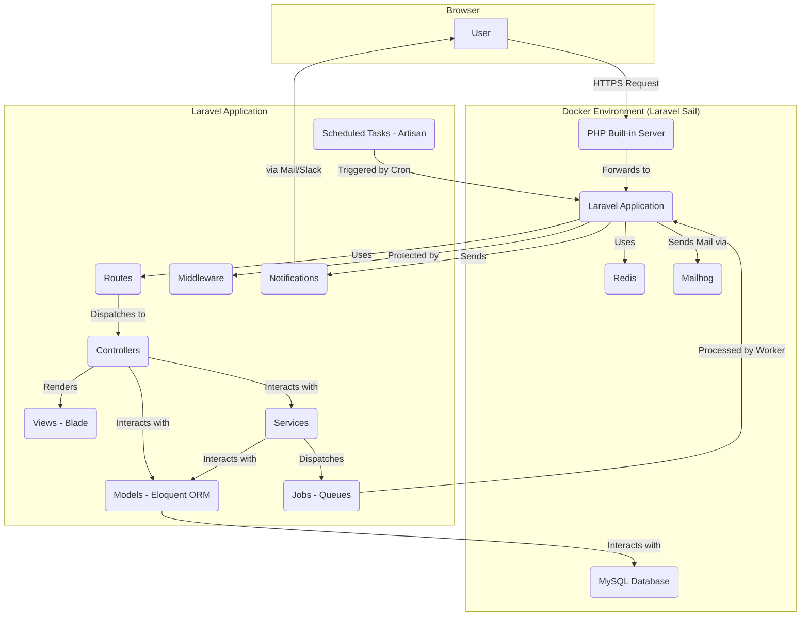

# KeyLMSNytro Technical Documentation

This document provides a comprehensive technical overview of the KeyLMSNytro application, a Learning Management System (LMS) built for the Key Company. It covers the application's architecture, technology stack, core functionalities, and key implementation details.

## 1. Project Overview

KeyLMSNytro is a web-based Learning Management System designed to manage and deliver educational courses and training programs. It provides distinct user roles, including students, trainers, leaders, and administrators, each with specific permissions and functionalities. The system supports course creation, student enrolment, progress tracking, assessments, and reporting.

## 2. Technology Stack

The application is built on a modern technology stack, containerized for consistent development and deployment environments. It is **not** a traditional LAMP stack.

| Component | Technology | Description |
|---|---|---|
| **Server-side Framework** | Laravel 11 (PHP 8.3) | A robust PHP framework following the MVC (Model-View-Controller) architectural pattern. |
| **Database** | MySQL 8.0 | A popular open-source relational database for storing all application data. |
| **Web Server** | PHP Built-in Server | The Laravel Artisan `serve` command is used for development, managed by Supervisor within the Docker environment. |
| **Containerization** | Docker (with Laravel Sail) | The entire development environment is containerized, ensuring consistency and ease of setup. |
| **Caching** | Redis | An in-memory data store used for caching and session management to improve performance. |
| **Frontend** | Blade Templating Engine | Laravel's native templating engine for rendering server-side views. |
| **Email Testing** | Mailhog | A local email testing tool to capture and display emails sent by the application during development. |
| **Task Scheduling** | Supervisor & Cron | Supervisor manages the PHP server process, while cron is used to trigger Laravel's scheduled tasks. |

## 3. High-Level Architecture

The application follows a standard Model-View-Controller (MVC) pattern, containerized within a Docker environment managed by Laravel Sail. The architecture is designed for scalability and maintainability.

### Architectural Flow

1.  A **User** sends an HTTP request from their browser.
2.  The request is received by the **PHP Built-in Server** running inside a Docker container.
3.  The server forwards the request to the **Laravel Application**.
4.  Laravel's **Router** (`routes/web.php`, `routes/api.php`) matches the request URI to a specific controller action.
5.  **Middleware** (`app/Http/Middleware/`) intercepts the request to perform tasks like authentication, authorization, and data validation before it reaches the controller.
6.  The **Controller** (`app/Http/Controllers/`) processes the request, interacts with **Models** and **Services** to retrieve or manipulate data.
7.  **Services** (`app/Services/`) contain the core business logic, separating it from the controllers.
8.  **Models** (`app/Models/`) use the **Eloquent ORM** to interact with the **MySQL Database**.
9.  The Controller then passes the retrieved data to a **Blade View** (`resources/views/`).
10. The Blade view is rendered into HTML and sent back to the user's browser.
11. For asynchronous tasks, the application dispatches **Jobs** to a **Queue**, which are processed in the background. **Redis** is used as the queue driver.
12. **Notifications** (e.g., emails, Slack alerts) are sent to users to inform them of important events.
13. **Scheduled Tasks** (defined in `app/Console/Kernel.php`) are executed periodically to perform maintenance and other routine tasks.

## 4. Key Laravel Features Used

The KeyLMSNytro application leverages several key features of the Laravel framework to build a robust and maintainable system.

### Model-View-Controller (MVC) Architecture

The codebase is well-structured following the MVC pattern:

*   **Models** (`app/Models/`): Represent the data structure and business logic. Key models include `User`, `Course`, `Lesson`, `Quiz`, and `Enrolment`.
*   **Views** (`resources/views/`): The presentation layer, built using the Blade templating engine. Views are organized by feature and include reusable components.
*   **Controllers** (`app/Http/Controllers/`): Handle user requests, interact with models and services, and return responses. Controllers are grouped by functionality (e.g., `LMS`, `AccountManager`, `Reports`).

### Eloquent ORM

Eloquent, Laravel's object-relational mapper, is used extensively for database interactions. Models define relationships (e.g., `hasMany`, `belongsTo`, `morphMany`) and use query scopes to create reusable query logic. For example, the `User` model has scopes like `onlyStudents()` and `onlyActive()`.

### Routing

The application defines web and API routes in `routes/web.php` and `routes/api.php`, respectively. Routes are organized into groups with middleware for authentication and authorization. Resourceful routing is used for CRUD operations on models like `Course` and `User`.

### Middleware

Custom middleware is used to protect routes and perform actions on incoming requests. Key middleware includes:

*   `Authenticate`: Ensures the user is logged in.
*   `PrivilegedMiddleware`: Redirects students from admin areas.
*   `OnBoardMiddleware`: Manages the student onboarding process.
*   `LlnAccessMiddleware`: Controls access to courses based on the completion of an LLN (Language, Literacy, and Numeracy) assessment.
*   `Spatie\Permission\Middlewares`: The `spatie/laravel-permission` package is used for role-based access control (RBAC).

### Blade Templating Engine

The frontend is rendered using Blade templates. The views are organized into layouts, partials, and components, promoting code reuse and maintainability.

### Task Scheduling

Laravel's task scheduler is used to automate routine tasks. Scheduled commands are defined in `app/Console/Kernel.php` and include:

*   Sending inactivity emails.
*   Pruning Telescope data.
*   Synchronizing student data.
*   Generating daily reports.

### Notifications and Mail

The application uses Laravel's notification system to send emails and Slack alerts. Notification classes are located in `app/Notifications/`, and Mailable classes are in `app/Mail/`. This system is used for password resets, new account notifications, assessment feedback, and system alerts.

### Queues and Jobs

To improve performance and user experience, long-running tasks are offloaded to a queue. Jobs, located in `app/Jobs/`, are used for tasks like processing quiz attempts, updating course progress, and cleaning student data. Redis is configured as the queue driver.

## 5. Database Schema

The database schema is defined through a series of migration files in `database/migrations/`. The schema is centered around users, courses, and their interactions. Key tables include:

*   `users`: Stores user account information.
*   `roles` & `permissions`: Manages user roles and permissions (from `spatie/laravel-permission`).
*   `courses`, `lessons`, `topics`, `quizzes`, `questions`: Defines the structure of the learning content.
*   `student_course_enrolments`: Tracks student enrolments in courses.
*   `quiz_attempts`: Stores student attempts at quizzes and assessments.
*   `course_progress`: Tracks student progress through courses.
*   `activity_log`: Logs user activity for auditing purposes.

## 6. Core Functionality

### User Roles and Permissions

The application uses the `spatie/laravel-permission` package to manage roles and permissions. The primary roles are:

*   **Student**: Can enroll in and complete courses.
*   **Trainer**: Manages and assesses students.
*   **Leader**: Manages companies and their associated students and trainers.
*   **Admin**: Has administrative access to the system.
*   **Root**: Super-administrator with full system access.

### Course and Content Management

Administrators can create and manage courses, lessons, topics, and quizzes through the backend interface. The content itself is created using a Gutenberg-like editor (`van-ons/laraberg`), allowing for rich text and media content.

### Student Onboarding and Enrolment

New students go through a multi-step onboarding process to collect necessary information. Leaders can enroll students in courses, and the system can be configured to automatically enroll students in subsequent courses upon completion of prerequisites.

### Assessments and Quizzes

The LMS includes a robust assessment system. Students can take quizzes, and their attempts are recorded and graded. Trainers can provide feedback and mark assessments as satisfactory or not satisfactory.

### Reporting

The application provides a variety of reports for administrators and leaders, including:

*   Enrolment reports
*   Competency reports
*   Work placement reports
*   Daily enrolment reports

## 7. Deployment

The application is designed to be deployed using Docker. The `docker-compose.yml` file defines the services required to run the application, including the Laravel application container, MySQL database, Redis, and Mailhog. Laravel Sail is used to manage the Docker development environment, simplifying the setup process for developers.

For production, a more robust setup would be required, likely involving a dedicated web server like Nginx, a managed database service, and a persistent Redis instance.
