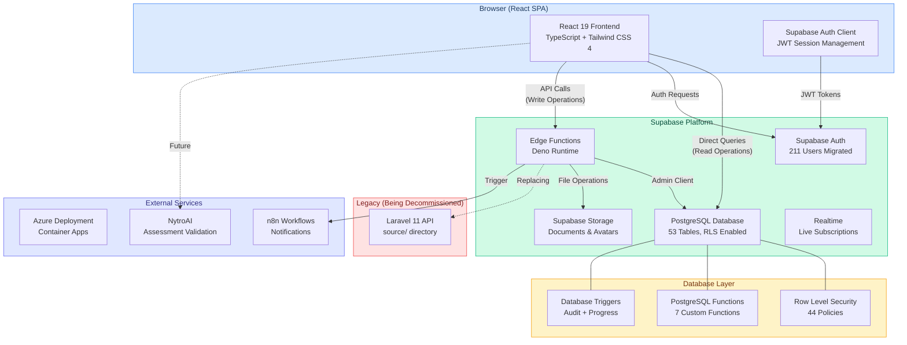
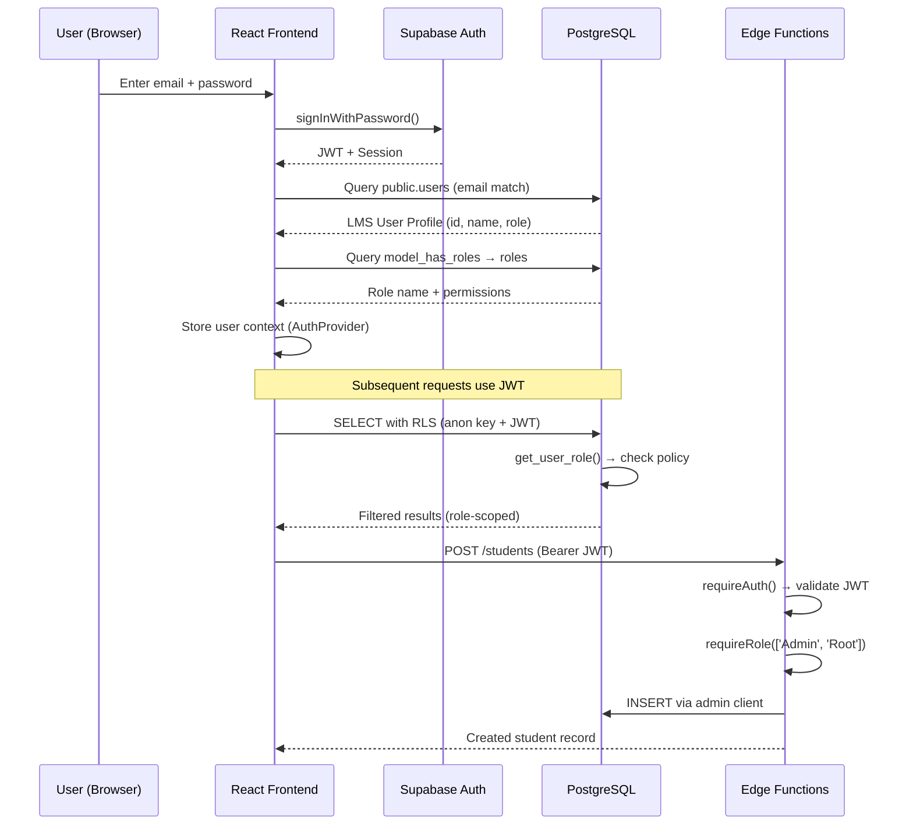
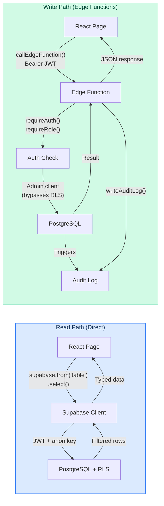
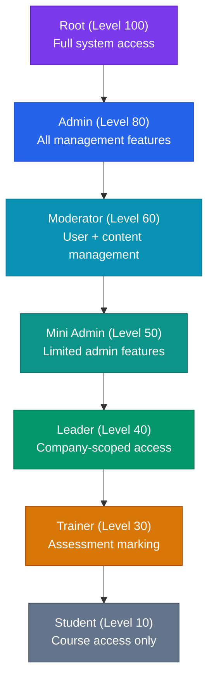
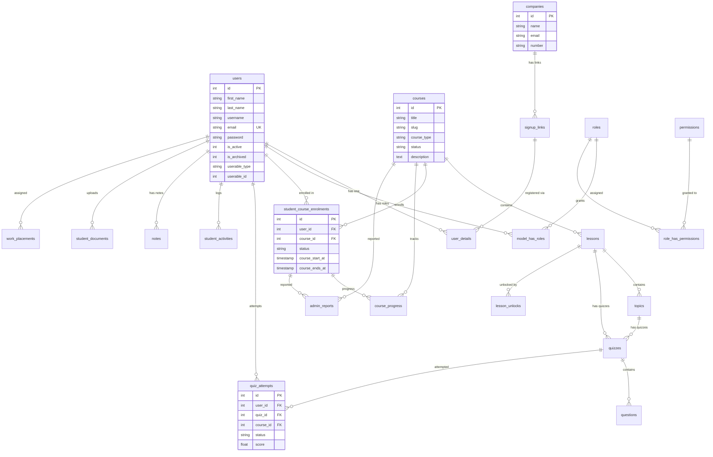
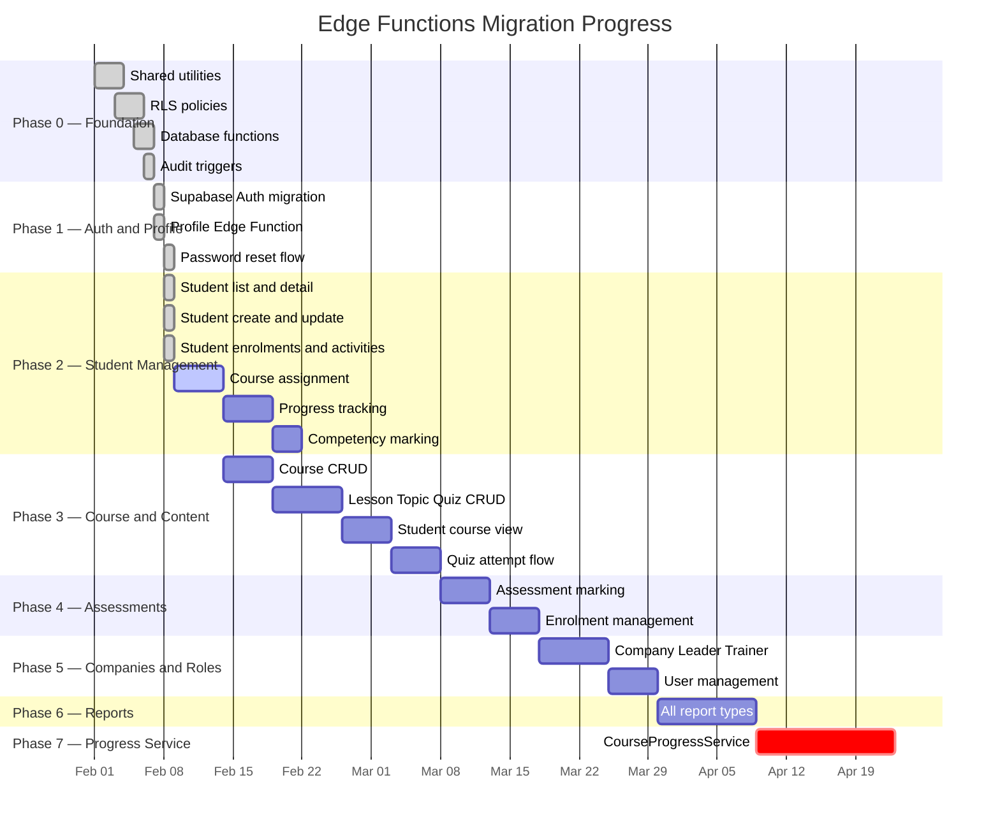

# NytroLMS — Learning Management System

**Modern, serverless LMS for Registered Training Organisations (RTOs), powered by Supabase and React.**

[](https://supabase.com)
[](https://react.dev)
[](https://www.typescriptlang.org)
[](https://tailwindcss.com)
[](https://azure.microsoft.com)

---

## 1. Overview

NytroLMS is a comprehensive Learning Management System designed for Australian RTOs. It manages the complete student lifecycle — from self-registration and onboarding through course enrolment, lesson delivery, quiz assessment, competency marking, and certificate issuance. The platform supports a role-based hierarchy (Root, Admin, Moderator, Mini Admin, Leader, Trainer, Student) with fine-grained permissions enforced at both the application and database layers.

The system has been actively migrated from a legacy Laravel/MySQL monolith to a modern **React + Supabase + Edge Functions** architecture. The database and authentication layers have been fully migrated. The React frontend is live with direct Supabase data access, and the Edge Functions backend is being progressively built to replace the remaining Laravel business logic.

### Key Capabilities

- **Student Management** — Full lifecycle from registration through graduation with progress tracking, competency records, and certificate issuance
- **Course Delivery** — Hierarchical content structure (Course → Lesson → Topic → Quiz) with rich text content via a block editor
- **Assessment System** — Quiz attempts with auto-grading, trainer evaluation, feedback loops, and competency marking
- **Role-Based Access** — Seven-tier role hierarchy with Spatie-compatible permission system, enforced via RLS policies
- **Company Management** — Multi-company support with signup links, leader oversight, and company-scoped student views
- **Reporting** — Admin reports, competency reports, enrolment reports, and daily registration reports
- **Audit Trail** — Comprehensive activity logging via database triggers on key tables
- **NytroAI Integration** — AI-powered assessment pre-marking and validation (see [KEYLMS_NYTROAI_INTEGRATION.md](./KEYLMS_NYTROAI_INTEGRATION.md))

---

## 2. Architecture

### 2.1 High-Level System Architecture



### 2.2 Authentication Flow



### 2.3 Data Flow Architecture



### 2.4 Role Hierarchy and Access Control



---

## 3. Technology Stack

### 3.1 Frontend

| Technology | Version | Purpose |
|---|---|---|
| React | 19.2 | UI framework (SPA with client-side routing) |
| TypeScript | 5.6 | Type safety across the entire frontend |
| Tailwind CSS | 4.1 | Utility-first styling with OKLCH colour tokens |
| shadcn/ui | Latest | Accessible component library (Radix primitives) |
| React Router | 7.x | Client-side routing with protected routes |
| Recharts | 2.15 | Dashboard charts and data visualisation |
| Framer Motion | 12.x | Animations and micro-interactions |
| Lucide React | 0.453 | Icon system |
| @supabase/supabase-js | 2.x | Supabase client for auth and direct DB queries |

### 3.2 Backend (Supabase Edge Functions)

| Technology | Purpose |
|---|---|
| Deno Runtime | Edge Function execution environment |
| TypeScript | Shared types with frontend |
| Supabase Admin Client | Privileged database operations (bypasses RLS) |
| Supabase User Client | Per-request JWT-scoped operations |

### 3.3 Database (Supabase PostgreSQL)

| Feature | Details |
|---|---|
| Tables | 53 public tables |
| Row Level Security | Enabled on all 53 tables, 44 active policies |
| Custom Functions | `get_user_role()`, `get_lms_user_id()`, `is_superior_role()`, `calculate_course_progress()`, `audit_log_trigger()`, `on_quiz_attempt_change()`, `rls_auto_enable()` |
| Triggers | Audit triggers on `users`, `courses`, `student_course_enrolments`, `quiz_attempts`; progress trigger on `quiz_attempts` |
| Auth Users | 211 migrated from legacy system |

### 3.4 Design System

The frontend follows the NytroAI design language with the following tokens:

| Token | Value | Usage |
|---|---|---|
| Primary Font | Outfit (600–800) | Headings, navigation, branding |
| Body Font | Inter (400–500) | Body text, form labels, data |
| Primary Blue | `#3b82f6` | Buttons, links, active states |
| Teal Accent | `#14b8a6` | Success states, progress indicators |
| Gold Accent | `#f59e0b` | Warnings, highlights, premium features |
| Background | `#f8f9fb` | Page background |
| Card Surface | `#ffffff` | Cards, panels, dialogs |
| Border Radius | `0.65rem` | Consistent rounded corners |

---

## 4. Repository Structure

```
NytroLMS/
├── frontend/                    # React SPA (11,505 lines TypeScript)
│   ├── src/
│   │   ├── pages/               # 11 page components
│   │   │   ├── Landing.tsx      # Public landing page with login dialog
│   │   │   ├── Dashboard.tsx    # KPI widgets, activity feed, charts
│   │   │   ├── Students.tsx     # Student list with search and filters
│   │   │   ├── Courses.tsx      # Course catalogue with progress stats
│   │   │   ├── Assessments.tsx  # Pending assessments for trainers
│   │   │   ├── Enrolments.tsx   # Enrolment management
│   │   │   ├── Companies.tsx    # Company directory
│   │   │   ├── Reports.tsx      # Admin and competency reports
│   │   │   ├── UserManagement.tsx # User CRUD with role assignment
│   │   │   ├── Settings.tsx     # Application settings
│   │   │   └── ResetPassword.tsx # Password reset flow
│   │   ├── components/          # Reusable UI components
│   │   │   ├── Sidebar.tsx      # Collapsible navigation sidebar
│   │   │   ├── DashboardLayout.tsx # Authenticated page wrapper
│   │   │   ├── LoginDialog.tsx  # Auth dialog (login/signup/reset)
│   │   │   ├── DataTable.tsx    # Generic sortable/filterable table
│   │   │   ├── KPIWidget.tsx    # Dashboard metric card
│   │   │   ├── StatusBadge.tsx  # Coloured status indicators
│   │   │   └── ui/             # shadcn/ui primitives
│   │   ├── lib/
│   │   │   ├── supabase.ts      # Supabase client configuration
│   │   │   ├── api.ts           # Data access layer (742 lines)
│   │   │   ├── edge-client.ts   # Edge Function HTTP client
│   │   │   └── types.ts         # Database type definitions (331 lines)
│   │   ├── hooks/
│   │   │   └── useSupabaseQuery.ts # Generic data fetching hook
│   │   └── contexts/
│   │       ├── AuthContext.tsx   # Authentication state (344 lines)
│   │       └── ThemeContext.tsx  # Theme management
│   ├── index.html
│   ├── package.json
│   ├── tsconfig.json
│   └── vite.config.ts
│
├── supabase/                    # Supabase Edge Functions (1,035 lines TypeScript)
│   └── functions/
│       ├── _shared/             # Shared utilities
│       │   ├── auth.ts          # JWT validation, role checks, permissions
│       │   ├── db.ts            # Admin + user Supabase client factories
│       │   ├── cors.ts          # CORS headers for cross-origin requests
│       │   ├── errors.ts        # Standardised error responses
│       │   ├── audit.ts         # Audit log writer (activity_log table)
│       │   └── types.ts         # Shared TypeScript interfaces
│       ├── profile/index.ts     # GET/PUT user profile (191 lines)
│       └── students/index.ts    # Student CRUD + enrolments + activities (408 lines)
│
├── scripts/                     # Migration and utility scripts
│   ├── migrate-auth-users.mjs   # Bulk create auth.users from public.users
│   ├── send-reset-emails.mjs   # Send password reset emails to all users
│   └── README.md               # Script usage documentation
│
├── KeyLMSDocs/                  # Project documentation
│   ├── EDGE_FUNCTIONS_MIGRATION_PLAN.md  # Full Laravel → Edge Functions plan
│   └── UI_REWRITE_PLAN.md               # Frontend modernisation plan
│
├── source/                      # Legacy Laravel 11 application (being decommissioned)
│   ├── app/                     # Controllers, Models, Services, Middleware
│   ├── routes/                  # web.php, api.php
│   ├── resources/               # Blade templates, SASS, JS
│   └── ...
│
├── KEYLMS_NYTROAI_INTEGRATION.md  # NytroAI integration documentation
├── AZURE_SUPABASE_DEPLOYMENT.md   # Azure deployment guide
├── TECHNICAL_RECOMMENDATIONS.md   # Architecture decision records
├── MULTI_TENANCY_ANALYSIS.md      # Multi-tenancy analysis
└── README.md                      # This file
```

---

## 5. Database Schema

### 5.1 Entity Relationship Diagram (Core Tables)



### 5.2 Current Data Volumes

| Table | Records | Description |
|---|---|---|
| `auth.users` | 211 | Supabase Auth accounts (migrated) |
| `users` | 211 | LMS user profiles |
| `courses` | 16 | Active courses |
| `lessons` | 138 | Lessons across all courses |
| `topics` | 531 | Topics within lessons |
| `quizzes` | 684 | Quizzes and assessments |
| `questions` | 3,768 | Quiz questions |
| `quiz_attempts` | 5,865 | Student quiz attempts |
| `student_course_enrolments` | 154 | Active enrolments |
| `companies` | 46 | Registered companies |
| `roles` | 7 | System roles |

### 5.3 Row Level Security

All 53 public tables have RLS enabled. The security model uses two custom PostgreSQL functions that extract user identity from the JWT:

- **`get_user_role()`** — Returns the user's role name (e.g., `'Admin'`, `'Student'`) by joining `auth.users` → `public.users` → `model_has_roles` → `roles`.
- **`get_lms_user_id()`** — Returns the user's `public.users.id` by matching the JWT email.

Policies follow a consistent pattern:

| Access Level | Roles | Example Tables |
|---|---|---|
| Public read | `anon` | `countries`, `courses` (published only) |
| Authenticated read | `authenticated` | `courses`, `lessons`, `topics`, `quizzes`, `questions`, `images` |
| Self + privileged read | Privileged roles OR `user_id = get_lms_user_id()` | `user_details`, `course_progress`, `competencies`, `quiz_attempts`, `student_activities` |
| Privileged read only | Root, Admin, Moderator, Mini Admin, Leader, Trainer | `admin_reports`, `signup_links`, `notes` |
| Admin write | Root, Admin | `courses`, `lessons`, `topics`, `quizzes`, `questions`, `settings`, `companies` |
| Self update | Own record only | `users` (email match), `user_details` (user_id match) |

---

## 6. Edge Functions

### 6.1 Implemented Functions

The following Edge Functions are deployed and operational:

#### `profile` — User Profile Management

| Method | Path | Description | Roles |
|---|---|---|---|
| GET | `/profile` | Get authenticated user's profile with role and details | Any authenticated |
| PUT | `/profile` | Update own profile (name, phone, address, etc.) | Any authenticated |

#### `students` — Student Management

| Method | Path | Description | Roles |
|---|---|---|---|
| GET | `/students` | List students with pagination, search, and filters | Admin, Root, Moderator, Mini Admin, Leader, Trainer |
| GET | `/students/:id` | Get student detail with enrolments, companies, progress | Admin, Root, Moderator, Mini Admin, Leader, Trainer |
| GET | `/students/:id/enrolments` | Get student's enrolments with course details | Admin, Root, Moderator, Mini Admin, Leader, Trainer |
| GET | `/students/:id/activities` | Get student's recent activity log | Admin, Root, Moderator, Mini Admin, Leader, Trainer |
| POST | `/students` | Create new student with Supabase Auth account | Admin, Root |
| PUT | `/students/:id` | Update student profile | Admin, Root |
| PATCH | `/students/:id` | Activate/deactivate student | Admin, Root |

### 6.2 Shared Utilities

| Module | Purpose |
|---|---|
| `_shared/auth.ts` | JWT validation, `requireAuth()`, `requireRole()`, `requirePermission()`, role hierarchy with `isSuperiorRole()` |
| `_shared/db.ts` | Factory functions for admin client (service role key, bypasses RLS) and user client (per-request JWT) |
| `_shared/cors.ts` | CORS headers for cross-origin Edge Function calls |
| `_shared/errors.ts` | Standardised JSON error responses with HTTP status codes |
| `_shared/audit.ts` | `writeAuditLog()` — writes to `activity_log` table |
| `_shared/types.ts` | Shared TypeScript interfaces for database models |

### 6.3 Migration Progress



---

## 7. Frontend Pages

### 7.1 Page Inventory

| Route | Page | Description | Data Source |
|---|---|---|---|
| `/` | Landing | Public landing page with animated background and login dialog | — |
| `/dashboard` | Dashboard | KPI widgets (students, courses, enrolments, assessments), activity feed, charts | `users`, `courses`, `student_course_enrolments`, `quiz_attempts` |
| `/students` | Students | Searchable student list with role, status, and company columns | `users`, `user_details`, `model_has_roles` |
| `/courses` | Courses | Course catalogue with lesson/topic/quiz counts and progress stats | `courses`, `lessons`, `topics`, `quizzes`, `course_progress` |
| `/assessments` | Assessments | Pending quiz attempts requiring trainer evaluation | `quiz_attempts`, `quizzes`, `users`, `courses` |
| `/enrolments` | Enrolments | Enrolment list with status, dates, and progress | `student_course_enrolments`, `users`, `courses`, `course_progress` |
| `/companies` | Companies | Company directory with student and signup link counts | `companies`, `signup_links`, `user_details` |
| `/reports` | Reports | Admin reports with filters, competency reports, export | `admin_reports`, `course_progress`, `competencies` |
| `/user-management` | User Management | User CRUD with role assignment and permission management | `users`, `model_has_roles`, `roles`, `role_has_permissions` |
| `/settings` | Settings | Application settings key-value management | `settings` |
| `/reset-password` | Reset Password | Password reset completion page (Supabase Auth redirect) | Supabase Auth |

### 7.2 Frontend Data Architecture

The frontend uses a dual data access pattern:

**Read operations** go directly to Supabase via the `supabase-js` client (`frontend/src/lib/api.ts`). This provides the fastest possible read path — the browser communicates directly with the Supabase PostgreSQL database, with RLS policies enforcing access control. The `useSupabaseQuery` hook provides loading states, error handling, and automatic refetching.

**Write operations** go through Edge Functions via the `edge-client.ts` helper (`callEdgeFunction()`). This ensures business logic validation, audit logging, and complex multi-table operations are handled server-side with the admin client.

---

## 8. Authentication

### 8.1 Current State

All 211 users have been migrated from the legacy Laravel `bcrypt` password hashes to Supabase Auth. Each `auth.users` entry contains metadata linking back to the LMS:

```json
{
  "raw_user_meta_data": {
    "lms_user_id": 42,
    "first_name": "Jane",
    "last_name": "Smith",
    "full_name": "Jane Smith",
    "role": "Leader",
    "migrated_from": "laravel"
  },
  "raw_app_meta_data": {
    "provider": "email",
    "role": "leader",
    "lms_user_id": 42
  }
}
```

### 8.2 Temporary Password

All migrated users have the temporary password **`NytroLMS2026!`**. Users should be prompted to reset their password on first login. The `send-reset-emails.mjs` script in `scripts/` can bulk-send password reset emails.

### 8.3 Role Distribution

| Role | Count |
|---|---|
| Student | 132 |
| Leader | 39 |
| Admin | 15 |
| Trainer | 14 |
| Mini Admin | 8 |
| Root | 3 |

---

## 9. Environment Variables

### 9.1 Frontend (Vite)

| Variable | Required | Description |
|---|---|---|
| `VITE_SUPABASE_URL` | Yes | Supabase project URL (e.g., `https://rshmacirxysfwwyrszes.supabase.co`) |
| `VITE_SUPABASE_ANON_KEY` | Yes | Supabase anonymous/public key |
| `VITE_USE_EDGE_FUNCTIONS` | No | Set to `'true'` to route write operations through Edge Functions |

### 9.2 Edge Functions

| Variable | Required | Description |
|---|---|---|
| `SUPABASE_URL` | Auto | Injected by Supabase runtime |
| `SUPABASE_ANON_KEY` | Auto | Injected by Supabase runtime |
| `SUPABASE_SERVICE_ROLE_KEY` | Auto | Injected by Supabase runtime (admin operations) |

---

## 10. Getting Started

### 10.1 Prerequisites

- Node.js 22+ and pnpm 10+
- Supabase CLI (for Edge Function development)
- Access to the Supabase project (`rshmacirxysfwwyrszes`)

### 10.2 Frontend Development

```bash
cd frontend
pnpm install
cp .env.example .env   # Add your Supabase credentials
pnpm dev               # Starts Vite dev server on http://localhost:3000
```

### 10.3 Edge Function Development

```bash
# Install Supabase CLI
npm install -g supabase

# Link to the project
supabase link --project-ref rshmacirxysfwwyrszes

# Serve functions locally
supabase functions serve --env-file .env.local

# Deploy a function
supabase functions deploy profile
supabase functions deploy students
```

### 10.4 Running Migration Scripts

```bash
# Preview (dry run)
SUPABASE_URL=https://rshmacirxysfwwyrszes.supabase.co \
SUPABASE_SERVICE_ROLE_KEY=your-service-role-key \
node scripts/migrate-auth-users.mjs --dry-run --active-only --verbose

# Execute migration
node scripts/migrate-auth-users.mjs --active-only --verbose

# Send password reset emails
node scripts/send-reset-emails.mjs --verbose
```

---

## 11. Recommended Next Steps

### 11.1 Immediate Priority (This Sprint)

| Task | Description | Effort |
|---|---|---|
| **Configure frontend secrets** | Add `VITE_SUPABASE_URL` and `VITE_SUPABASE_ANON_KEY` to the deployment environment | 30 min |
| **Send password reset emails** | Run `send-reset-emails.mjs` so all 211 users can set their own passwords | 1 hr |
| **Deploy Edge Functions** | Deploy `profile` and `students` functions to Supabase | 1 hr |
| **Enable `VITE_USE_EDGE_FUNCTIONS`** | Switch frontend write operations to use Edge Functions | 30 min |

### 11.2 Short-Term (Weeks 1–4)

| Task | Description | Effort |
|---|---|---|
| **Course assignment Edge Function** | Migrate `StudentController.assign_course` — the most-used write operation | 8 hr |
| **Enrolment management Edge Function** | Create, update, and change status of enrolments | 10 hr |
| **Assessment marking Edge Function** | Trainer evaluation, feedback, and competency marking | 12 hr |
| **Student-facing LMS pages** | Build course view, lesson view, topic view, and quiz-taking pages in React | 40 hr |
| **Student detail page** | Full student profile with enrolments, progress, activities, documents, and notes | 16 hr |

### 11.3 Medium-Term (Weeks 5–10)

| Task | Description | Effort |
|---|---|---|
| **Course content authoring** | Admin CRUD for courses, lessons, topics, quizzes, and questions | 30 hr |
| **Company and leader management** | Company CRUD, signup link management, leader assignment | 16 hr |
| **Report Edge Functions** | Admin reports, competency reports, enrolment reports | 20 hr |
| **Notification system** | Integrate n8n for email notifications (assessment feedback, enrolment confirmations) | 12 hr |
| **NytroAI integration** | Connect the AI pre-marking system to the assessment workflow | 16 hr |

### 11.4 Long-Term (Weeks 10–14)

| Task | Description | Effort |
|---|---|---|
| **CourseProgressService migration** | Migrate the 4,700-line progress calculation engine to PostgreSQL functions | 65 hr |
| **Azure deployment automation** | GitHub Actions CI/CD for frontend (Azure Static Web Apps) and Edge Functions | 8 hr |
| **Decommission Laravel** | Remove `source/` directory once all Edge Functions are validated | 4 hr |
| **Performance testing** | Load test Edge Functions and RLS policies under production volumes | 8 hr |
| **Mobile responsiveness** | Ensure all pages work well on tablet and mobile devices | 16 hr |

### 11.5 Architecture Decision: When to Decommission Laravel

The `source/` directory containing the legacy Laravel application should be removed from the repository once the following conditions are met:

1. All P0 (Critical) Edge Functions are deployed and validated in production.
2. All P1 (High) Edge Functions are deployed and validated in production.
3. A parallel validation period of at least 2 weeks has passed with no discrepancies between Laravel and Edge Function responses.
4. All frontend pages are wired to Edge Functions for write operations.
5. The `VITE_USE_EDGE_FUNCTIONS` feature flag has been set to `true` in production for at least 1 week.

---

## 12. Related Documentation

| Document | Description |
|---|---|
| [KeyLMSDocs/EDGE_FUNCTIONS_MIGRATION_PLAN.md](./KeyLMSDocs/EDGE_FUNCTIONS_MIGRATION_PLAN.md) | Comprehensive audit of all Laravel business logic with Edge Function equivalents |
| [KeyLMSDocs/UI_REWRITE_PLAN.md](./KeyLMSDocs/UI_REWRITE_PLAN.md) | Frontend modernisation plan (React + Tailwind + shadcn/ui) |
| [KEYLMS_NYTROAI_INTEGRATION.md](./KEYLMS_NYTROAI_INTEGRATION.md) | NytroAI assessment validation integration |
| [AZURE_SUPABASE_DEPLOYMENT.md](./AZURE_SUPABASE_DEPLOYMENT.md) | Azure deployment guide for Supabase-backed applications |
| [TECHNICAL_RECOMMENDATIONS.md](./TECHNICAL_RECOMMENDATIONS.md) | Architecture decision records |
| [MULTI_TENANCY_ANALYSIS.md](./MULTI_TENANCY_ANALYSIS.md) | Multi-tenancy analysis (single-tenant by design) |
| [scripts/README.md](./scripts/README.md) | Migration script usage documentation |

---

*Last updated: 9 February 2026*
